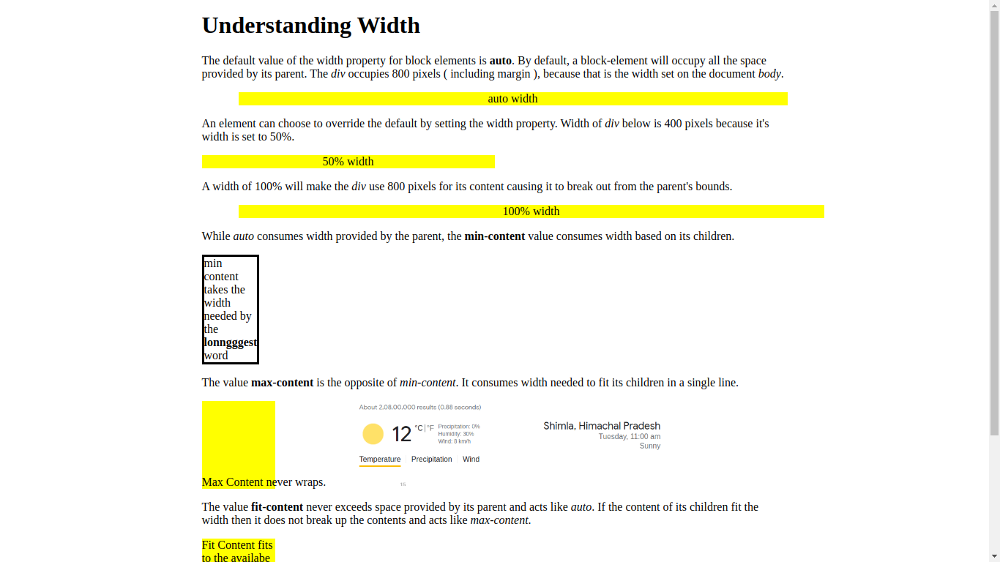

# Learn CSS

Learn CSS offline by cloning this repository and following through individual lessons:

```
$ git clone https://github.com/ardsrk/learn_css.git
$ firefox html/01_basics.html
```

## Sample Lesson



